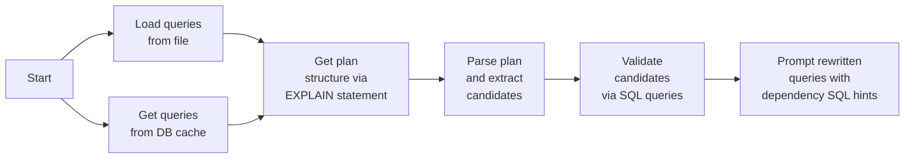

# HADA: HANA Data Dependency Assistant
<div align="center">

[](https://youtu.be/d_Ans-DByB4)

### [HADA Demonstration Screencast](https://youtu.be/d_Ans-DByB4)

</div>

[//]: # (**Note: Relies on non-main HANA instance, required adaptations are in https://hdbgerrit.wdf.sap.corp/c/hana/+/1603703.**)

Automatic SQL-based dependency discovery for the rewrite, i.e., candidate generation and validation plus SQL rewriting using the validated dependencies.
Candidates are generated based on information from `EXPLAIN PLAN` statements.
To work properly, we adapted the plan info builder to translate predicates to the base tables if they were originally formulated on a view.
This modification is turned on by setting the `FIELD_NAME_ALIGNMENT` session variable to `'TRUE'` (happens automatically in the script).
We support functional dependencies (FDs) and order dependencies (ODs) because these are the relevant ones for the targeted query rewrites.


## Components

- `python/` contains the dependency discovery implementation:

  - `dependency_discovery.py` provides the core `DependencyDiscoveryRunner` class with all steps of the pipeline.
  - `hada_cli.py` provides a CLI for the pipeline execution.
  - `hada_web.py` provides a web-based UI for interactive dependency exploration and query rewriting.
  - `query_plan.py` and  `data_dependencies.py` serve data structures used to represent the parsed plans and the (candidate) dependencies.
  - `estimate_genuiness_score.py` provides the `GenuinenessEstimator`/`OdGenuinenessEstimator` classes used to score invalid FD/OD candidates (see [Genuineness scoring](#genuineness-scoring) below).

- `resources/` contains sample workloads.
- `docs/` contains additional documentation, including [`FRONTEND.md`](docs/FRONTEND.md) for the web interface.

## Web Interface (HaDA Web)

The web interface provides an interactive UI for exploring dependencies and rewriting queries. Run it with:

```sh
streamlit run python/hada_web.py
```

### Features

- **SQL Query Editor**: Enter queries with syntax highlighting
- **Dependency Discovery**: Discover FD and OD dependencies from queries
- **Dependency Selection**: Select up to 5 dependencies with color-coded visualization
- **Query Rewriting**: Generate rewritten queries with `DEV_DATA_DEPENDENCIES` hints
- **Query Plan Visualization**: View original and rewritten plans in Graph or Text format
- **Plan Comparison**: Side-by-side comparison with difference highlighting
- **Performance Testing**: Continuous execution with START/STOP controls, warmup runs, and live charts
- **Demo Mode**: Test features without a database connection using example queries

### Requirements

Additional Python packages for the web interface:

```sh
pip install streamlit streamlit-ace pandas Pillow
```

## Workflow




## Usage

The  `DependencyDiscoveryRunner` class performs all of the individual pipeline steps.
When executed via the `hada_cli.py` script, it exeutes the entire pipeline for multiple queries in a batch, depending on the provided CLI parameters.

```

  --schema SCHEMA [SCHEMA ...], -s SCHEMA [SCHEMA ...]
                        Used schema(s). Default: SYSTEM
  --fd-rewrite          Generate and validate candidates for the FD-based
                        multi-predicate TSSJ for genuine semi-joins (default)
  --no-fd-rewrite       Do not generate and validate candidates for the FD-
                        based multi-predicate TSSJ for genuine semi-joins
  --od-rewrite          Generate and validate candidates for the OD-based
                        range-predicated TSSJ
  --no-od-rewrite       Do not generate and validate candidates for the OD-
                        based range-predicated TSSJ (default)
  --queries QUERIES, -q QUERIES
                        File with SQL queries. If not provided, use the SQL
                        plan cache for the provided schema
  --import-queries IMPORT_QUERIES, -i IMPORT_QUERIES
                        File with SQL queries to load the data
  --preparation-queries PREPARATION_QUERIES, -p PREPARATION_QUERIES
                        File with SQL queries to prepare the workspace (e.g.,
                        to set session parameters)
  --cleanup-queries CLEANUP_QUERIES, -c CLEANUP_QUERIES
                        File with SQL queries to cleanup the workspace (e.g.,
                        to remove temporary tables)
  --drop-schema         Drop the used schema after finishing
  --od-strategy {query,checkers,query_rank}
                        OD validation strategy. Default: query
  --od-batch-size OD_BATCH_SIZE
                        Batch size to retrieve data while validating order
                        dependencies using the 'checkers' strategy. Smaller
                        values benefit invalid candidates, larger values
                        benefit valid candidates. Default: 1000
```

Even though the script executes executes the pipeline for a batch of queries, the `DependencyDiscoveryRunner` class can also be used to incrementally start the pipeline for individual queries.

The script expects a `database_connection.json` file in the calling directory that provides the connection parameters.
For an example, see [`resources/sample_database_connection.json`](resources/sample_database_connection.json).

Some sample workloads are provided in the `resources` directory, including loading commands for the datasets, preparation queries to setup the sessions, SQL workloads, and optional cleanup queries to remove helper structures or settings required by the queries.
Subdirectories are named after the corresponding schema, with an optional counter suffix if the same schema is used with different data.
The data can be optionally loaded and dropped from the script to automate these steps, too.

See some usage examples below:

```sh
# Full run incl. data loading and unloading and targeting both rewrites
./python/hada_cli.py -s TPCDS -i resources/tpcds/import.sql -q resources/tpcds/queries.sql --od-rewrite --drop-schema

# Run without data loading and dropping, but with preparation and cleanup queries
./python/hada_cli.py -s SAPQM7 -p resources/sapqm7_3/prerun.sql -q resources/sapqm7_3/queries.sql \\
                     -c resources/sapqm7_3/postrun.sql

# Run with data loading, preparation, cleanup, and data unloading for a workload across multiple schemas
./python/hada_cli.py -s S0NCSTR S0SCSQMS -p resources/daimler/prerun.sql -q resources/daimler/queries.sql \\
                     -c resources/daimler/postrun.sql --drop-schema
```

**Note on the preprocessed queries: In order to take effect, further finetuning might be necessary to convince the optimizer to use the rewritten TSSJ (e.g., hints `NO_HEX_INDEX_JOIN`, `NO_PREAGGR_BEFORE_JOIN`, ...).
Further filtering joins in between the target semi-join and the base table can prevent the rewrite.**

## Details

The dependency validation is simplified to facilitate the use cases of the targeted query rewrites.
One major simplifiation is to restrict to FD and OD candidates with a single left-hand side (LHS).
Doing so, we can collect all candidates with the same LHS column and validate them using a single SQL query.

To speedup the incremental scenario, there are internal caches for the validation results (both vor valid and invalid candidates).

### FD validation

All candidates with the same LHS are grouped and validated on one go, exploiting that valid FDs have exactly one not-`NULL` dependent value per determinant value.
We use a query template that looks like this for an example FD candidate `{ column_a } → { column_b, column_c, ... }` on `table_a` :

```SQL
SELECT max(column_b_dst),
       max(column_b_has_null),
       max(column_c_dst),
       max(column_c_has_null)
       ...
  FROM (  SELECT count(distinct column_b) AS column_b_dst,
                 sum(CASE WHEN column_b IS NULL THEN 1 ELSE 0 END) AS column_b_has_null,
                 count(distinct column_c) AS column_c_dst,
                 sum(CASE WHEN column_c IS NULL THEN 1 ELSE 0 END) AS column_c_has_null
                 ...
            FROM table_a
        GROUP BY column_a
       ) internal_agg;
```

The inner `internal_agg` query counts the number of distinct values for each dependent value grouped by the determinant `*_dst`.
If the FD is valid, there must be one value per group.
By further aggregating the maximum of the individual group values, we collect the result for the entire table (`1` if valid, higher else).
The second aggregation `*_has_null` becomes `0` if there are no `NULL`s and higher if there are `NULL`s.
This is relevant for the rewrite because unselected tuples with the same determinant value are a problem.

For each dependent candidate, we get two result fields (first must be `1`, second must be `0`) that we can simply iterate.

### OD validation

Similarly to the FD validation, we issue only a single query for all OD candidates with the same LHS column.
For example, let the following be an input query:

```SQL
SELECT catalog_sales.*
  FROM catalog_sales INNER MANY TO ONE JOIN date_dim ON cs_sold_date = d_date_sk
 WHERE d_year = 2000
   AND d_moy = 7
   AND d_dom BETWEEN 15 AND 31
```

We have to check the two candidates `[ d_date_sk ] ↦ [ d_year, d_moy, d_dom ]` and `[ d_date_sk ] ↦ [ d_moy, d_year, d_dom ]`
(candidates from equality predicates can have any permutations of these columns).
We could order only once and fetch the result set:

```SQL
  SELECT d_year, d_moy, d_dom
    FROM date_dim
ORDER BY d_date_sk;
```

Then, we create different OD checkers that iterate the rows of the result set.
Each checker validates an OD candidate from one permutation of columns from equality predicates (plus column from inequality predicate).
We abort if all checkers found violations.
To speedup the process, we do not fetch each result row individually, but in batches.
The size of these batches can be controlled with the `--od-batch-size` CLI parameter.
Smaller batches lead to faster rejections if all candidates are invalid (fewer rows are transferred), larger batches benefit valid candidates (fewer API calls).
A similar approach could be implemented using a SQLScript procedure, avoiding the result set transfer to the client.
This validation strategy is used when `--od-strategy checkers` is passed.
For our sample data ([`tpcds_demo`](resources/tpcds_demo/), comparing many tuples in Python was a bottleneck for valid ODs on larger tables (we did not see many permutations though).

We could use window functions with ranks and compare these ranks, but the queries become rather complex if we have multiple candidates.
One issue is that we have to check all possible permutations of the candidate columns that come from equality predicates.
For the candidates above, a plain SQL validation query could look like this:

```SQL
SELECT min(valid_d_year_d_moy_d_dom),
       min(valid_d_moy_d_year_d_dom)
  FROM (SELECT rnk_d_year_d_moy_d_dom - lag(rnk_d_year_d_moy_d_dom, 1, 0) OVER (ORDER BY d_date_sk) AS valid_d_year_d_moy_d_dom,
               rnk_d_moy_d_year_d_dom - lag(rnk_d_moy_d_year_d_dom, 1, 0) OVER (ORDER BY d_date_sk) AS valid_d_moy_d_year_d_dom
          FROM (SELECT d_date_sk,
                       rank() OVER (ORDER BY d_year, d_moy, d_dom) AS rnk_d_year_d_moy_d_dom,
                       rank() OVER (ORDER BY d_moy, d_year, d_dom) AS rnk_d_moy_d_year_d_dom
                  FROM date_dim
               ) internal_rank
       ) internal_rank_offsets;
```

The most-inner query `internal_rank1` provides the ordering according to the candidate RHSs.
The second query `internal_rank2` compares the current row's rank to the rank of the preceding tuple when ordered by the LHS.
Finally, we take the min of this column, where a negative value indicates that a larger value followed a smaller one.
This approach avoids materializing a large result set, but requires to order the entire table once per OD RHS (including permutations) and additionally by the LHS.
It can be chosen by passing `--od-strategy query_rank`.
Even though we sort multiple times, it was faster than the checker-based solution for a valid OD on a large table (with only two permutations).
